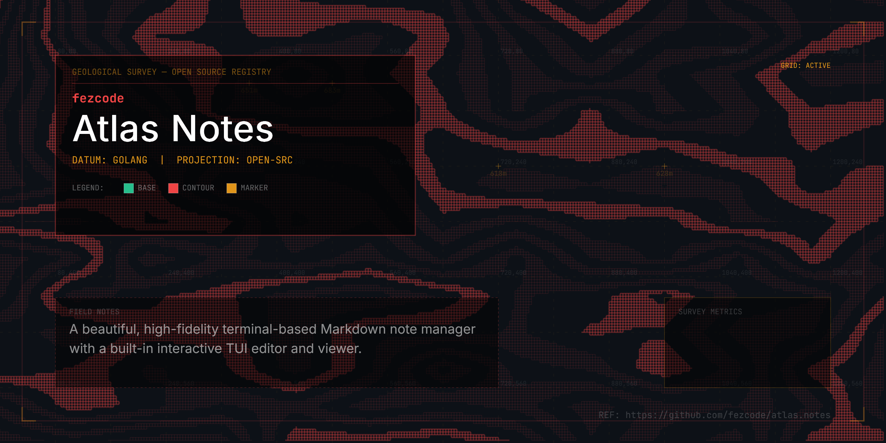

# atlas.notes



`atlas.notes` is a beautiful, high-fidelity terminal-based Markdown note manager for the **Atlas Suite**. It features a full interactive TUI that allows you to create, read, and write notes without ever leaving your terminal.

## ✨ Features
- 📝 **Built-in Editor:** Multi-line editing directly in the TUI—no external editor required (though you can still use one!).
- 🎨 **High-Fidelity Rendering:** Uses `glamour` for beautiful, stylized markdown viewing.
- 📂 **Local First:** Notes are stored as standard `.md` files in `~/.atlas/atlas.notes.data/`.
- ⌨️ **Keyboard Centric:** Fast navigation and CRUD operations with intuitive keybindings.
- 🛠️ **Part of Atlas Suite:** Designed to work seamlessly with other Atlas tools.

## 🚀 Installation

### Via Atlas Hub (Recommended)
`atlas.notes` is part of the Atlas ecosystem. You can manage it via `atlas.hub`:

```bash
# Once synced, you can use atlas.hub to discover and manage
atlas.hub list Productivity
```

### From Source
Requires [gobake](https://github.com/fezcode/gobake) for multi-platform builds.

```bash
git clone https://github.com/fezcode/atlas.notes
cd atlas.notes
gobake build
```
Binaries will be generated in the `build/` directory.

## 🕹️ Controls

| Key | Action |
|-----|--------|
| `↑/↓` or `k/j` | Navigate notes list |
| `Enter` | Read/Render selected note |
| `n` | Create a new note |
| `e` | Edit note content (Internal Editor) |
| `d` | Delete note (requires confirmation) |
| `q` or `Esc` | Quit / Back to List |

### Internal Editor
| Key | Action |
|-----|--------|
| `Ctrl+S` | Save changes and return to reader |
| `Esc` | Discard changes and return to list |

## 📂 Storage
Your notes are saved in:
`~/.atlas/atlas.notes.data/`

## 📄 License
MIT
